  <picture>
    <source media="(prefers-color-scheme: dark)" srcset="./dark.svg">
    <source media="(prefers-color-scheme: light)" srcset="./light.svg">
    
  </picture>

## About Me

I'm Hisham, a BCA student at IGNOU based in Kerala, India. I'm building a foundation in cybersecurity, networking, Linux/system administration and Python, with a career direction toward cybersecurity and SOC-related roles.

## Cybersecurity Focus

- Cybersecurity fundamentals
- SOC / security monitoring
- Networking
- Linux administration
- Red Hat
- Kali Linux
- Ethical hacking
- Python
- System administration

## Technical Skills

| Area | Skills |
| --- | --- |
| Languages | Python |
| Operating systems | Linux, Red Hat, Kali Linux |
| Networking | Networking fundamentals (Diploma in Networking) |
| Cybersecurity | Cybersecurity fundamentals, Ethical hacking |

## Tools & Technologies

`Python` · `Linux` · `Red Hat` · `Kali Linux`

<!--
## Projects

Add real projects here once they exist, for example:

- [project-name](https://github.com/root-hisham/project-name) — one-line description
-->

## Current Learning

- BCA studies (IGNOU)
- Cybersecurity
- SOC concepts
- Linux
- Networking
- Python
- System administration

## GitHub Contributions

  <picture>
    <source media="(prefers-color-scheme: dark)" srcset="https://raw.githubusercontent.com/root-hisham/root-hisham/output/github-snake-dark.svg">
    <source media="(prefers-color-scheme: light)" srcset="https://raw.githubusercontent.com/root-hisham/root-hisham/output/github-snake.svg">
    
  </picture>

## Connect With Me

- LinkedIn: [linkedin.com/in/hisham19](https://www.linkedin.com/in/hisham19)
- GitHub: [github.com/root-hisham](https://github.com/root-hisham)
